# LAB-45-policy-route
tanggal 24 agustus 2025

# policy-route
PBR (Policy Based Route) merupakan fitur yang berfungsi untuk memetakan jalur. Kita bisa memetakan berdasarkan alamat IP asal, IP tujuan, bisa juga kita buat yang lebih spesifik lagi berdasarkan koneksi (port dan protokol).

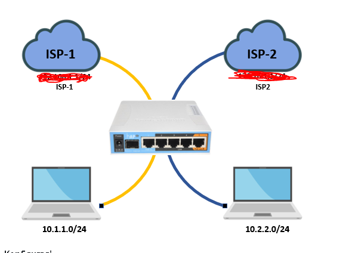

**Konfigurasi**
Pada tahap ini, pastikan kita sudah melakukan basic config (IP Address, DNS, NAT, dll). Kemudian kita bisa coba untuk lakukan konfigurasi PBR. Pada kasus ini kita akan konfigurasi PBR1 menggunakan Route Rules.

# konfigurasi policy based route failover netwatch mikrotik
1. seting dhcp client dulu disini isp saya dari ether 1 dan wlan1
   pilih menu ip > dhcp client klik add 

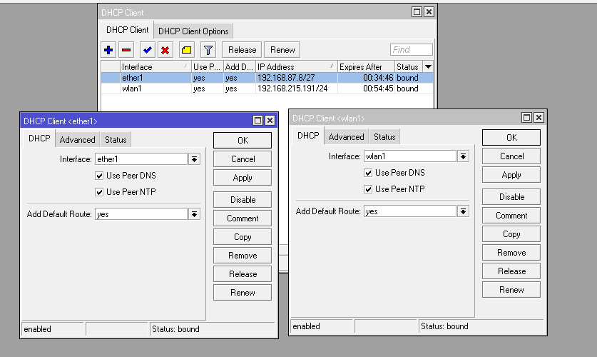

2. lalu buat ip address untuk LAN1 dan LAN2
   di menu ip > address 

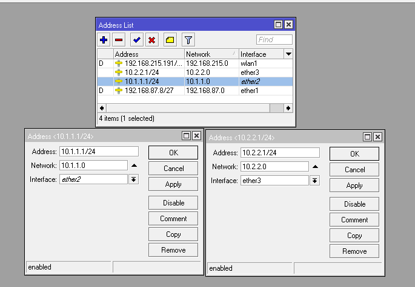

3. berikutnya buat dhcp server untuk ether 2 dan 3 kenpa yang ether2 saya merah karena tida terhubug/blm tercolokkan
   pilih menu ip > dhcp server

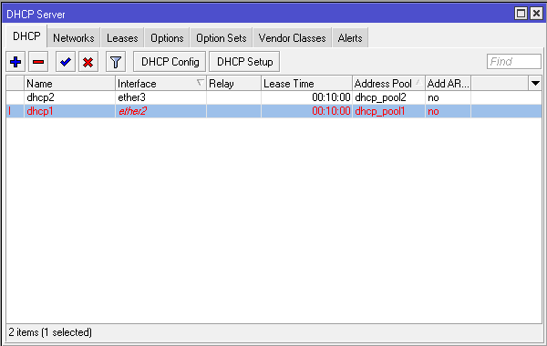

4.  lalu setting firewall dengan action kedua nya menggunakan masquerade
    di menu ip > firewall

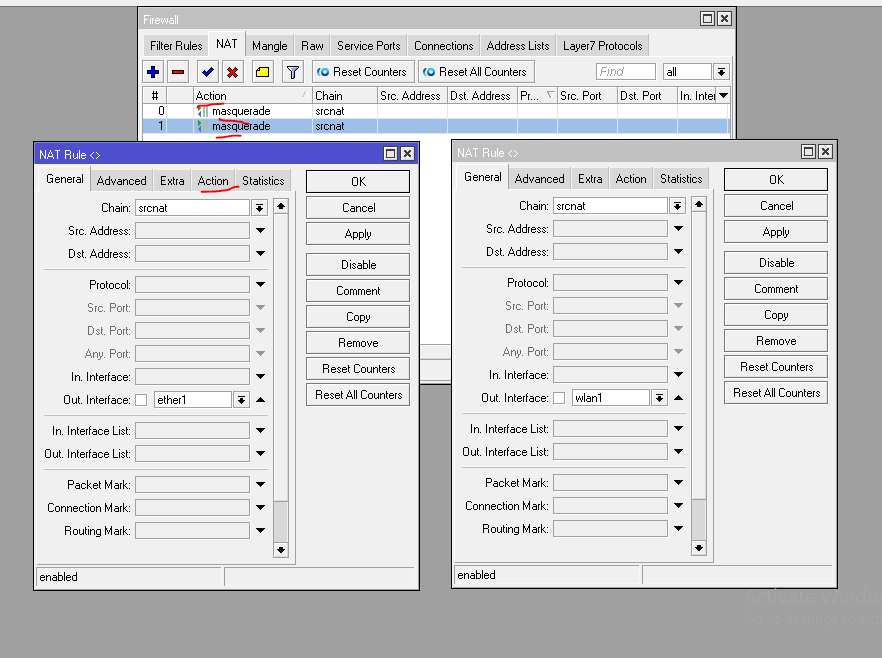

5. jika sudah maka kita akan melakukan konfigurasi berikutnta yaitu route
   pilih menu ip > routes > rules konfigurasi seperti gambar berikut

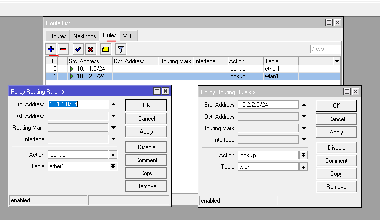

6. selanjutnya kita beralih ke tab routes untuk membuat route netwach

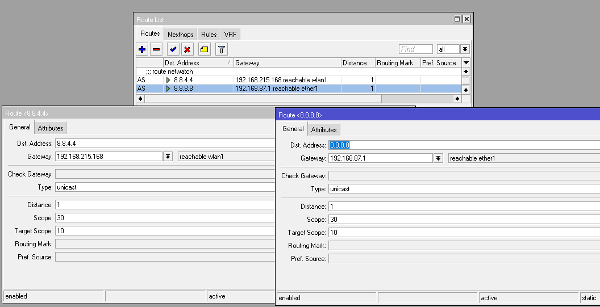

7. masi di tab routes kita buat juga konfigurasi policy based routes

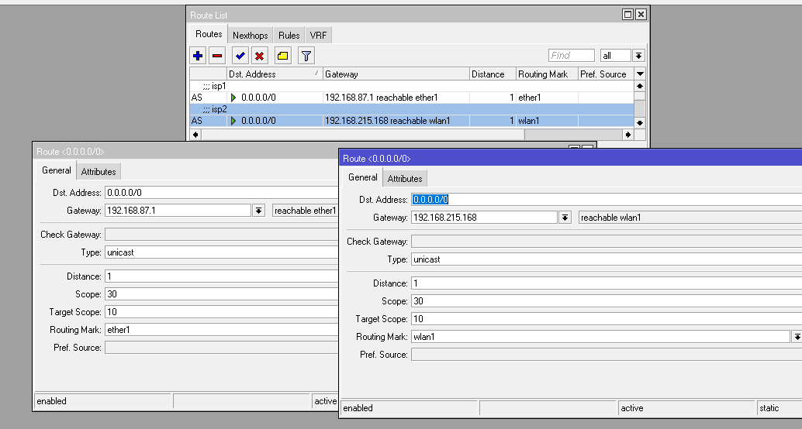

8. konfigurasi route untuk link backup

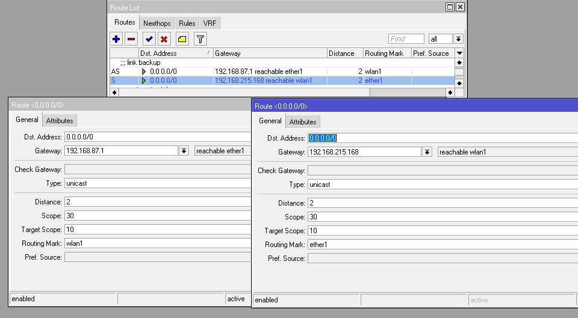

9. konfigurasi netwatch
   di menu tools > netwatch

   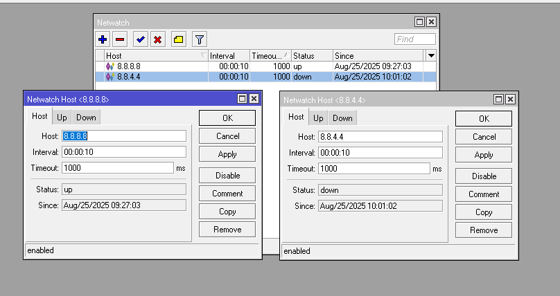

   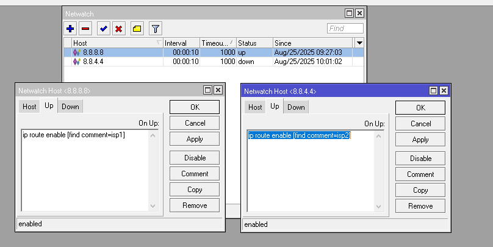

   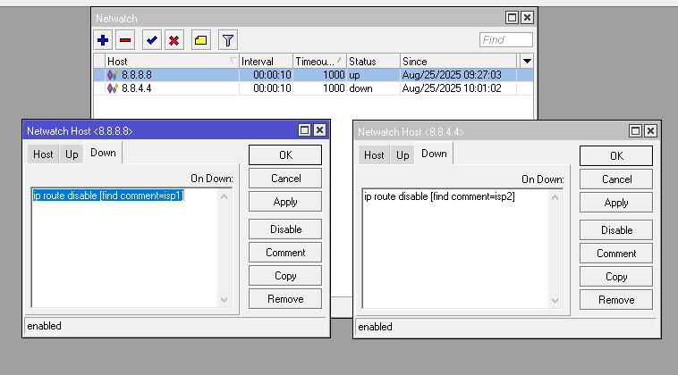

# pengujian 
1. tracert di laptop kuning

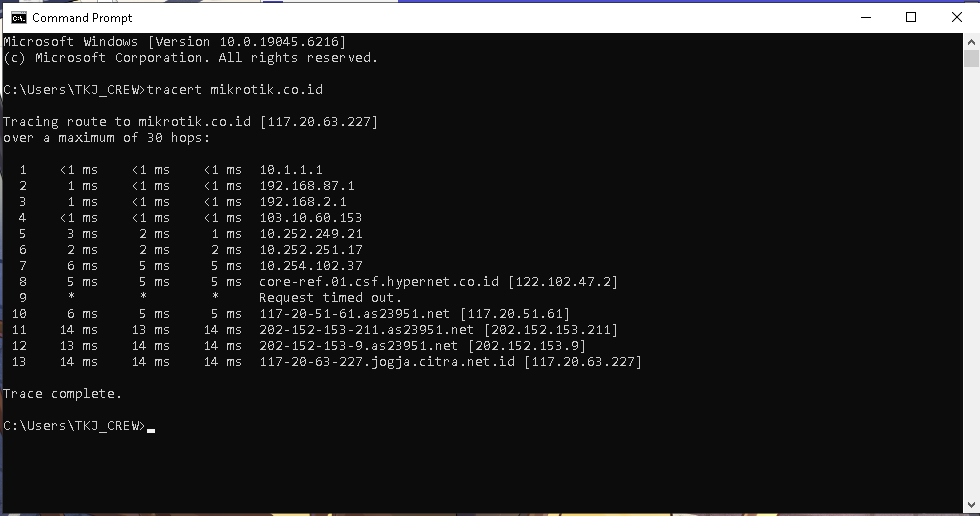

2. tracert di laptop biru

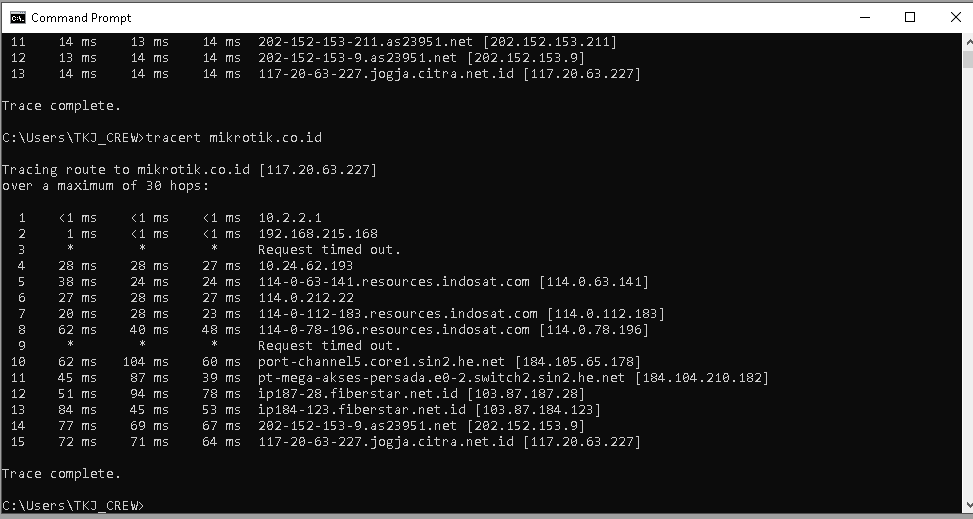

# kesimpulan
Policy-Based Routing (PBR) adalah metode pengaturan lalu lintas jaringan yang memungkinkan administrator jaringan untuk membuat keputusan routing berdasarkan kebijakan tertentu, bukan hanya berdasarkan tabel routing standar. Dengan PBR, lalu lintas dapat diarahkan berdasarkan parameter seperti alamat IP sumber/destinasi, jenis protokol, port, atau bahkan ukuran paket.
# sumber 
https://youtu.be/lYLvUE9tRbc?si=65SQiZwTBG7DGSuz
